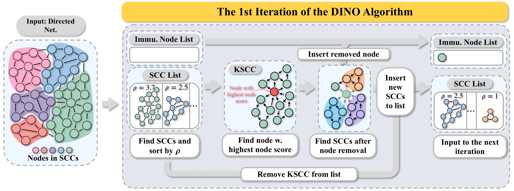

# DINO Code Project

## Introduction

This is the official implementation of the proposed model 'DINO' from the paper *Demystify Epidemic Containment in Directed Networks: Theory and Algorithms*


**TL;DR**: DINO is a novel algorithm for epidemic containment on directed networks that identifies critical nodes to immunize in order to maximally reduce the network's spectral radius and contain epidemic spread.


**Framework Overview**:

The DINO (DIrected NetwOrk epidemic containment) framework is a comprehensive approach to epidemic containment in directed networks. It begins with a theoretical analysis that establishes the epidemic threshold condition for directed networks, provides a tight bound for spectral radius estimation, and proves the relationship between the spectral radius of key strongly connected components (KSCCs) and the entire network. The core of DINO is its node selection algorithm, which identifies the KSCC and iteratively selects nodes for removal using a custom node score function. This function efficiently approximates the reduction in spectral radius resulting from node removal, based on the derived spectral radius estimation. The framework employs an iterative process, repeating node selection and removal for a specified budget of k nodes, while updating the network structure and KSCC after each removal. By leveraging these theoretical insights and algorithmic components, DINO efficiently identifies critical nodes in directed networks for maximal epidemic containment, avoiding the use of matrix perturbation methods unsuitable for directed networks. The result is an asymptotically optimal solution with linear time complexity, making DINO both effective and computationally efficient for large-scale directed networks.




## Arguments
Here is a table of the argument parameters for the DINO project based on the provided code:

| Argument | Default | Description |
|----------|---------|-------------|
| -d, --dataset | 'p2p-Gnutella08' | The directed network dataset |
| -k, --k | None | Number of nodes for immunization |
| -r, --r | 2 | Number of eigenvalues considered for recovering the adjacency matrix |
| -m, --measure | 'dino' | Node immunization algorithm |
| -nn, --node_num | 130 | Node number of the network if args.dataset is erdos_renyi |
| -erd, --erdos_renyi_density | 0.01 | Erdos Renyi graph density (not used in erdos_renyi_unon) |
| -kp, --k_percent | 0.05 | Percent of nodes in dataset to be selected for immunization |
| -et, --epidemic_type | None | Epidemic type for epidemic simulation |

Note:
- The choices for --dataset are: 'hiv_transmission', 'Email-EuAll', 'p2p-Gnutella08', 'erdos_renyi', 'soc-Epinions1', 'WikiTalk', 'Wiki-Vote'
- The choices for --measure are based on the keys in MEASURE_MAP
- The choices for --epidemic_type are: 'SIR', 'SIS', 'SEIR'


## Usage

Here is an example to run DINO

##### 1. Prepare environment
Install the environment with ```conda env create -n graph --file environment.yml```.

##### 3. Run code
To play with our 'DINO', one may simply run
```
python main.py --d [dataset] -k [node immunization budget]
```


## Reference

The implementation of DINO is straightforward and does not refer to any Github repositories.

